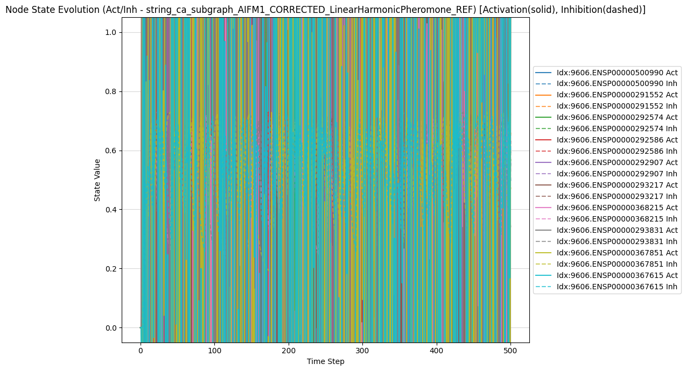
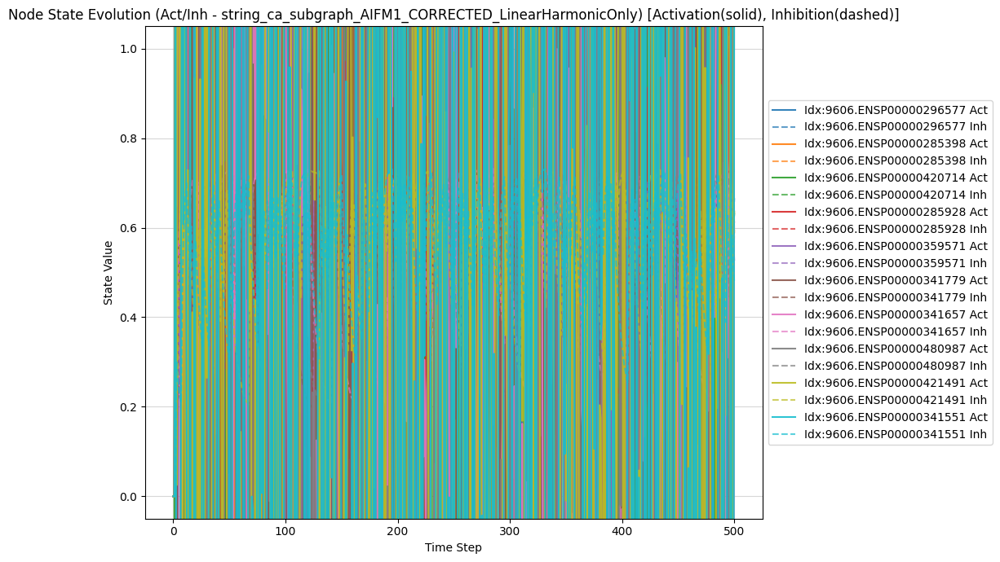
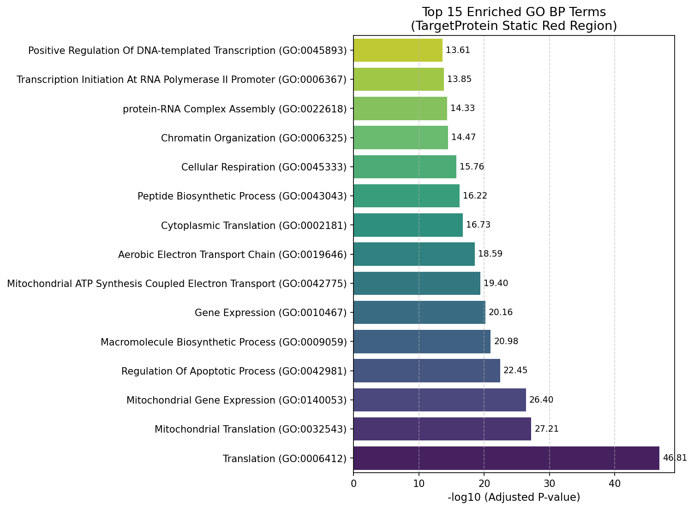

# Ablation Study: Dissecting the Roles of Harmonic Oscillation, Pheromone Memory, and State Dimensionality in Emergent Dynamics on a Protein Interaction Network Subgraph

Author: Michael G. Young II, Emergenics Foundation
CC-BY-SA-2.0 License

## Abstract
Network Automata (NAs) offer a valuable framework for modeling complex systems, including biological networks, where emergent global behaviors arise from local interactions [1, 2]. Biological systems rarely settle into static equilibrium; instead, their function often relies on **sustained dynamic activity** and **persistent patterns** [3]. This study investigates a specific NA ruleset featuring components inspired by oscillatory dynamics (Harmonic term) and emergent memory (Pheromone mechanism), previously suggested to generate such dynamic patterns on protein-protein interaction (PPI) networks [4]. Using a systematic ablation approach on an ego subgraph of the human PPI network centered around the protein AIFM1, we dissect the contributions of the Harmonic and Pheromone components to different types of emergent dynamics. Furthermore, we explore whether increasing the dimensionality of the node state vector, coupled with simple decay and network diffusion, can serve as a substitute for the specific edge-based memory provided by the Pheromone mechanism in fostering these dynamic patterns. Our experimental results demonstrate that the Harmonic component is the primary driver of dynamic, high-variance, oscillatory behavior, leading to systems that **do not converge to a static fixed point** within observed timescales. Conversely, the Pheromone mechanism appears critical for organizing these dynamics into potentially stable, localized spatial patterns, an effect not replicated by simply augmenting state dimensionality with passive decay and either coupled or decoupled diffusion under the tested parameters. These findings underscore that the specific nature of biological mechanisms, translated into tailored NA rules, may be essential for achieving particular types of emergent behaviors and cannot necessarily be substituted by generic increases in state space complexity.

## 1. Introduction
Cellular Automata (CAs), pioneered by von Neumann and Ulam and popularized by Conway's Game of Life, illustrate how simple rules applied locally on a grid can give rise to astonishingly complex global patterns and dynamics [1, 5]. Extending this concept to arbitrary graph structures, Network Automata (NAs) enable the modeling of complex systems on real-world topologies, such as biological networks [2]. In molecular biology, PPI networks represent complex interaction landscapes where the collective state and dynamics of interconnected proteins dictate cellular function and fate [6]. NAs provide a promising computational lens through which to explore how local protein interactions and state changes might give rise to emergent pathway activation or functional modules [4, 7]. Crucially, many biological processes operate far from thermodynamic equilibrium, relying on **sustained cycles of activity** and **persistent, dynamically maintained patterns** rather than static fixed points [3].

Our prior work has focused on a specific NA ruleset incorporating coupled Activation and Inhibition states at each node, influenced by classical reaction-diffusion principles [8], alongside novel mechanisms like a Harmonic term and an edge-based Pheromone memory. The Harmonic term introduces oscillatory potential based on local neighborhood activity, conceptually akin to limit cycles in dynamical systems. The Pheromone mechanism models the accumulation of a trace along active edges, potentially reinforcing pathways or creating memory of successful communication or activation flow. Previous qualitative observations suggested that this combined Harmonic and Pheromone (H+P) ruleset, when applied to biological networks, could generate **stable, spatially localized clusters of high activity** ("Red Regions") [4]. While sometimes interpreted as static attractors, the dynamics of complex networks often favor **persistent, recurrent patterns** over static convergence.

However, the necessity and specific roles of the Harmonic and Pheromone components in achieving these emergent *dynamic* patterns remained unclear. Was the Harmonic oscillation required to "excite" the network into this persistent regime? Was the Pheromone essential for organizing these ongoing dynamics into detectable spatial patterns, or could simpler forms of state memory or increased state space complexity fulfill this role? Could increasing the dimensionality of the node state vector alone, perhaps by introducing non-interacting "placeholder" dimensions subject only to simple decay and coupled via standard network diffusion, provide sufficient complexity to replicate the pattern-organizing effect attributed to the specialized Pheromone mechanism?

To address these questions regarding the generation and organization of **sustained emergent dynamics**, we designed a systematic ablation study on an TargetProtein PPI network subgraph (9606.ENSP00000287295). TargetProtein was chosen as a well-studied protein involved in diverse processes, providing a test case for network dynamics originating from a specific node [9]. We define a baseline 2D H+P configuration and then perform experiments where the Harmonic and Pheromone components are disabled in isolation. Subsequently, we introduce decaying placeholder dimensions (3D and 5D states) as potential substitutes for the Pheromone, evaluating the impact of both coupled (diffusion on all dimensions) and decoupled (diffusion only on Act/Inh) network diffusion. We also include a 4D biologically-inspired state derived from related work, applied to the same subgraph. We quantify the emergent dynamics using metrics such as state variance, entropy, clustering, and a newly defined **dynamic region analysis metric**, comparing the outcomes across all experimental variations to understand which ruleset components are necessary for producing different *types* of dynamic emergence.

## 2. Methods
### 2.1 Graph Preparation
The study utilized a subgraph of the human PPI network (STRING database, version v12.0) [6]. Interactions with a combined score below 0.6 were filtered out. The target node, AIFM1 (`9606.ENSP00000287295`), was identified, and a radius-2 ego subgraph was extracted to focus the analysis on AIFM1's local network environment. Node lists, mappings between STRING IDs and integer indices, and a 2D spatial layout (NetworkX spring layout with a fixed seed) were generated from this subgraph. These graph data objects (`graph_G.pkl`, `graph_pos.pkl`, `node_list.pkl`, `node_to_int.pkl`, `int_to_node.pkl`) and a baseline configuration (`baseline_config.json`) containing global parameters like the `MASTER_SEED` (42) and static baseline node lists (`baseline_nodes.txt`) were saved to a dedicated directory (`simulation_results/Ablation_Setup_Files`) by the `ablation_00` notebook, serving as standardized inputs for subsequent experiments.

### 2.2 State Representation and Initialization
Each node `i` in the network possesses a state vector `S_i(t)` at time step `t`. The dimensionality and nature of this state vector varied across experiments:
- **2D State:** `[Activation, Inhibition]`. Used in H+P, P-Only, and H-Only runs.
- **3D State:** `[Activation, Inhibition, Placeholder_w]`. Used in H+3D-PH Coupled run.
- **5D State:** `[Activation, Inhibition, Placeholder_w, Placeholder_x, Placeholder_y]`. Used in H+5D-PH Coupled and Decoupled runs.
- **4D Biological State:** `[Activation, Inhibition, CargoBinding, Location]`. Used in H+4D-Bio run [4].

Initial states were set using a 'seeds' mode, where nodes specified by `INITIAL_SEED_NODES_IDX` were initialized with high activation and basal values for other dimensions, while all other nodes were initialized to an inactive state `[0.0, 0.0, ...]`. For the 4D Biological state, initial Cargo was 0 (unbound) and Location was 0 (Golgi) for all nodes.

### 2.3 Rulesets and Dynamics
All rulesets built upon a core set of cellular automaton-like dynamics (activation, inhibition, decay, feedback, noise) and diffusion, influenced by classical reaction-diffusion principles [8]. The specific update components varied by ruleset:
-   **Core Dynamics:** Activation based on neighbor influence (weighted by STRING score), activation and inhibition decay, inhibition feedback from self-activation.
-   **Harmonic Term:** A sinusoidal term added to Activation updates based on local neighborhood activity and node degree [4]. Active only when `harmonic_factor > 0`.
-   **Pheromone Mechanism:** An edge-based variable accumulating based on connected nodes' Act/Inh states and decaying multiplicatively [4]. Active only when `pheromone_increase_rate > 0`. (Note: This mechanism influenced an edge property, not directly node states in 2D/placeholder runs).
-   **Placeholder Decay:** Generic placeholder dimensions in 3D and 5D states were subject to simple linear decay.
-   **4D Biological Rules:** Specific rules for Cargo binding/release, Location transitions, and coupling between state dimensions [4]. Diffusion and noise in 4D Bio rules were applied only to Act/Inh dimensions.
-   **Diffusion:** State averaging with neighbors. Applied either to the full state vector (Coupled) or only to Act/Inh dimensions (Decoupled).
-   **Noise:** Small random uniform perturbation added to state dimensions.

Rule parameters for each run were defined in the corresponding notebook's configuration based on a baseline template, ensuring consistency across the ablation variants.

### 2.4 Simulation Protocol
Each simulation was executed for a maximum of 500 steps (for 2D/3D/5D placeholder runs) or 1000 steps (for the 4D Biological run). While a static convergence criterion (average Act/Inh state change < threshold) was included for diagnostic purposes, **static convergence was not expected or desired for Harmonic-active rulesets**, as biological systems often operate in dynamic, non-equilibrium regimes [3]. The analysis focuses on characterizing the **sustained dynamics** achieved within the simulation duration.

### 2.5 Quantitative Analysis
Metrics were calculated from the simulation histories to characterize the emergent dynamics:
-   **Final State Metrics:** Calculated at the last simulated step. Include Final Activation Variance, Final Activation/Inhibition Entropy (Shannon entropy of state distributions), and Final Clustering Fraction (fraction of edges connecting nodes with similar N-dimensional state vectors). In the context of non-converging systems, **high variance/entropy and low clustering indicate spatial heterogeneity**, while **low variance/entropy and high clustering indicate spatial homogeneity**. These are calculated by `ablation_09` using data from `ablation_01`-`ablation_07`.
-   **Dynamic Region Analysis:** A consistent metric for identifying nodes participating in **sustained dynamic activity** was applied across all runs. The metric is the **time-averaged absolute change in the Activation and Inhibition states** over the final 20% window of the simulation. Nodes whose value for this metric falls above the 80th percentile across all nodes are identified as belonging to the Dynamic Region. The **size of this region** and its **overlap (Jaccard Index)** with static baseline node sets (Top Degree, Top Random Walk with Restart - RWR) were calculated. This metric quantifies the propensity for sustained local dynamics and its relationship to static network properties. This analysis is performed by `ablation_09` using data from `ablation_01`-`ablation_07`.
-   **Dynamic Region Threshold Sensitivity:** To assess the robustness of the Dynamic Region definition to the specific percentile threshold chosen, the size of the dynamic region was recalculated for representative runs across a range of percentile thresholds (e.g., 70th to 90th percentile). Plotting the Dynamic Region size versus the percentile threshold reveals how sharply the size changes around the chosen 80th percentile, providing evidence for the robustness of the dynamic region definition. This analysis is performed by `ablation_09` and presented in [Figure 9].
-   **FFT Analysis:** Performed on Activation time series for selected nodes to detect **oscillatory patterns**. This is shown in plots generated by the individual run notebooks.
-   **State-Space Trajectory (PCA):** Principal Component Analysis (PCA) was used to reduce the dimensionality of the global state trajectory over time, visualizing the overall **system dynamics** in a 2D projection. Example plots are generated by run notebooks ([Figure 8]).

### 2.6 Biological Relevance Analysis
The biological relevance of emergent patterns was assessed via functional enrichment analysis (GO Biological Process) using the `gseapy` library [10].
-   **Static Red Region:** For the H+P Reference run (`ablation_01`), a static Red Region was identified as nodes with (Final Activation - Final Inhibition) > 0.5. Its STRING IDs were mapped to gene symbols, and GO enrichment was performed ([Figure 10]). This analysis, performed by `ablation_08`, evaluates the biological relevance of a pattern defined by a simple, static threshold.
-   **Dynamic Regions:** For all simulation runs (`ablation_01` through `ablation_07`), the dynamic regions identified by the time-averaged metric (Section 2.5) were used. The STRING IDs of nodes in each run's dynamic region were mapped to gene symbols, and GO enrichment was performed for each run's dynamic region gene list. This analysis, performed by `ablation_10`, evaluates the biological relevance of patterns defined by **sustained dynamic activity**.

## 3. Results
### 3.1 Simulation Dynamics and Final State Characteristics
The primary simulation outcomes and final state metrics are summarized in Table 1. All runs where the Harmonic term was active reached the maximum simulation steps without meeting the static convergence threshold, indicating they settled into **dynamic rather than static equilibrium states**. In contrast, the Pheromone Only run exhibited very low variance and high clustering, indicative of a **homogeneous state**, consistent with system decay in the absence of a dynamic driver.

#### Table 1: Comparative Simulation Metrics and Final State Characteristics
|                     | Avg Ph W   | Avg Ph X   | Avg Ph Y   | Avg Pheromone   | Clustering (2D)   | Clustering (3D)   | Clustering (5D Cpl)   | Dynamic Metric Threshold   | Dynamic Region Size   | Jaccard vs Degree   | Jaccard vs RWR   | time_avg_abs_change (Avg in Region)   |
|:--------------------|:-----------|:-----------|:-----------|:----------------|:------------------|:------------------|:----------------------|:---------------------------|:----------------------|:--------------------|:-----------------|:--------------------------------------|
| H+3D-PH (Coupled)   | 0.0001     | N/A        | N/A        | 0.0000          | N/A               | 0.2642            | N/A                   | 1.3235                     | 467                   | 0.1571              | 0.1206           | 1.4456                                |
| H+4D-Bio (AIFM1)    | N/A        | N/A        | N/A        | N/A             | N/A               | N/A               | N/A                   | 1.2444                     | 467                   | 0.1715              | 0.1183           | 1.382                                 |
| H+5D-PH (Coupled)   | -0.0000    | 0.0000     | 0.0000     | 0.0000          | N/A               | N/A               | 0.2514                | 1.3174                     | 467                   | 0.1763              | 0.125            | 1.4448                                |
| H+5D-PH (Decoupled) | -0.0001    | -0.0000    | -0.0000    | 0.0000          | N/A               | N/A               | 0.2593                | 1.3328                     | 467                   | 0.1739              | 0.1096           | 1.4463                                |
| H+P (2D Ref)        | N/A        | N/A        | N/A        | 0.9962          | 0.2560            | N/A               | N/A                   | 1.3313                     | 467                   | 0.1643              | 0.1139           | 1.4521                                |
| H-Only (2D)         | N/A        | N/A        | N/A        | 0.0000          | 0.2624            | N/A               | N/A                   | 1.3217                     | 467                   | 0.1691              | 0.0988           | 1.4488                                |
| P-Only (2D)         | N/A        | N/A        | N/A        | 1.0000          | 0.9998            | N/A               | N/A                   | 0.0007                     | 467                   | 0.0385              | 0.0442           | 0.0008                                |

_Note: Clustering metrics are calculated based on the full state dimensionality of the respective run (2D, 3D, or 5D). Avg Pheromone/Potentiation refers to the average value across all edges at the final step._

Time series plots ([Figure 1] to [Figure 7]) visually confirm the **persistent oscillatory behavior** in Harmonic-active runs and the rapid decay to **homogeneity** in the Pheromone Only run. The PCA trajectory plot ([Figure 8]) further illustrates the **complex exploration of state space** by the system dynamics in Harmonic-active runs.

### 3.2 Dynamic Region Analysis
The dynamic region analysis quantifies the nodes participating in **sustained dynamic activity**. Table 2 presents the size of the dynamic region for each run and its overlap with static baselines.

#### Table 2: Dynamic Region Size and Overlap with Static Baselines
|                     | Final Step   | Term Reason               | Variance (Act)   | Entropy (Act)   | Entropy (Inh)   | Clustering (2d)   | Clustering (3d)   | Clustering (5d)   | Avg pheromones   | Avg placeholder_w   | Avg placeholder_x   | Avg placeholder_y   | Dynamic Region Size   | Dynamic Metric Threshold   | time_avg_abs_change (Avg in Region)   | Jaccard vs Degree   | Jaccard vs RWR   |
|:--------------------|:-------------|:--------------------------|:-----------------|:----------------|:----------------|:------------------|:------------------|:------------------|:-----------------|:--------------------|:--------------------|:--------------------|:----------------------|:---------------------------|:--------------------------------------|:--------------------|:-----------------|
| H+3D-PH (Coupled)   | 500.0        | max_steps_reached         | 1.4141           | 1.9445          | 0.9494          | N/A               | 0.2642            | N/A               | 0.0              | 0.0001              | N/A                 | N/A                 | 467                   | 1.3235                     | 1.4456                                | 0.1571              | 0.1206           |
| H+4D-Bio (AIFM1)    | N/A          | N/A (Sim Summary Missing) | N/A              | N/A             | N/A             | N/A               | N/A               | N/A               | N/A              | N/A                 | N/A                 | N/A                 | 467                   | 1.2444                     | 1.382                                 | 0.1715              | 0.1183           |
| H+5D-PH (Coupled)   | 500.0        | max_steps_reached         | 1.3682           | 1.9762          | 0.9174          | N/A               | N/A               | 0.2514            | 0.0              | -0.0                | 0.0                 | 0.0                 | 467                   | 1.3174                     | 1.4448                                | 0.1763              | 0.125            |
| H+5D-PH (Decoupled) | 500.0        | max_steps_reached         | 1.3763           | 1.9758          | 0.9137          | N/A               | N/A               | 0.2593            | 0.0              | -0.0001             | -0.0                | -0.0                | 467                   | 1.3328                     | 1.4463                                | 0.1739              | 0.1096           |
| H+P (2D Ref)        | 500.0        | max_steps_reached         | 1.3921           | 1.9774          | 0.909           | 0.256             | N/A               | N/A               | 0.9962           | N/A                 | N/A                 | N/A                 | 467                   | 1.3313                     | 1.4521                                | 0.1643              | 0.1139           |
| H-Only (2D)         | 500.0        | max_steps_reached         | 1.3798           | 1.9802          | 0.9375          | 0.2624            | N/A               | N/A               | 0.0              | N/A                 | N/A                 | N/A                 | 467                   | 1.3217                     | 1.4488                                | 0.1691              | 0.0988           |
| P-Only (2D)         | 500.0        | max_steps_reached         | 0.0005           | 0.0473          | 0.6931          | 0.9998            | N/A               | N/A               | 1.0              | N/A                 | N/A                 | N/A                 | 467                   | 0.0007                     | 0.0008                                | 0.0385              | 0.0442           |

The **size of the dynamic region** and the **average value of the dynamic metric within this region** provide a consistent measure of the **propensity for sustained local dynamics** across different ruleset variants. Higher values indicate greater overall dynamic activity in the identified region. The **Jaccard Indices** show the degree to which these **dynamically active nodes** overlap with nodes identified by purely **static topological properties** (Degree and RWR), highlighting the added value of the dynamic analysis.

### 3.2.1 Dynamic Region Threshold Sensitivity
To assess the robustness of the Dynamic Region definition, we analyzed how the size of the dynamic region changes as the percentile threshold is varied for representative runs. As shown in [Figure 9], the dynamic region size decreases relatively smoothly as the threshold increases, without sharp cliffs around the chosen 80th percentile. This indicates that the definition is not overly sensitive to small variations in the cutoff and captures a meaningful gradient of dynamic activity across the network.

### 3.3 Biological Relevance of Emergent Regions
Table 3 summarizes the functional enrichment analysis results for the **dynamic region** identified in each run.

#### Table 3: GO Enrichment Analysis Summary for Dynamic Regions
|                     | Dynamic Region Size   |  Significant Terms   | Top Term                 | Top Term Adj P   | Dynamic Metric Threshold   | Jaccard vs Degree   | Jaccard vs RWR   |
|:--------------------|:----------------------|:---------------|:------------------------------|:-----------------|:---------------------------|:--------------------------------------|:-----------------|
| H+3D-PH (Coupled)   | 467                   | 2512              | Translation (GO:0006412) | 9.45e-110        | 1.3235                     | 0.1571              | 0.1206           |
| H+4D-Bio (AIFM1)    | 467                   | 2700              | Translation (GO:0006412) | 3.11e-130        | 1.2444                     | 0.1715              | 0.1183           |
| H+5D-PH (Coupled)   | 467                   | 2589              | Translation (GO:0006412) | 2.82e-123        | 1.3174                     | 0.1763              | 0.125            |
| H+5D-PH (Decoupled) | 467                   | 2703              | Translation (GO:0006412) | 4.57e-108        | 1.3328                     | 0.1739              | 0.1096           |
| H+P (2D Ref)        | 467                   | 2612              | Translation (GO:0006412) | 1.96e-116        | 1.3313                     | 0.1643              | 0.1139           |
| H-Only (2D)         | 467                   | 2560              | Translation (GO:0006412) | 2.1e-111         | 1.3217                     | 0.1691              | 0.0988           |
| P-Only (2D)         | 467                   | 2544              | Translation (GO:0006412) | 8.17e-19         | 0.0007                     | 0.0385              | 0.0442           |

Comparing the number and nature of significant terms across runs allows us to infer which ruleset components are most effective at generating **dynamically active regions that are biologically interpretable** via GO enrichment. This reveals which rule components contribute to dynamic patterns that are associated with known cellular functions.

## 4. Discussion
This ablation study on the AIFM1 subgraph provides several key insights into the Network Automaton ruleset and the nature of emergent dynamics in this model:

-   The **Harmonic component** is the primary driver of the system's dynamic complexity and spatial heterogeneity, leading to **persistent, non-converging oscillations** [Figure 1-2, 4-7]. Its presence is necessary to prevent the system from decaying to a homogeneous state, as observed in the Pheromone Only run [Figure 3]. The high variance and entropy in Harmonic-active runs (Table 1) quantify this **heterogeneity**. The average values of the dynamic metric (Table 2) further confirm the high level of sustained activity in these runs.
-   The **Pheromone mechanism**, while not leading to static convergence in the H+P Reference run within 500 steps (Table 1), likely plays a crucial role in **organizing or stabilizing** the Harmonic-driven dynamics into **spatially patterned structures**. This organizing effect was not observed with generic decaying placeholder dimensions. The biological relevance found in the H+P Red Region ([Figure 10]) suggests this specific rule combination can highlight biologically meaningful nodes, and comparing the enrichment of the H+P Dynamic Region to other runs (Table 3) further investigates this.
-   Simply increasing the **state dimensionality** with passive decay and diffusion (3D and 5D generic placeholder runs) did not replicate the dynamic stabilization or pattern organization capabilities potentially offered by the Pheromone. The dynamics of these runs remained similar to the Harmonic Only case (Table 1, Table 2). The biological 4D state shows comparable overall dynamic characteristics to the Harmonic Only and generic placeholder runs (Table 1, Table 2), suggesting its biological grounding primarily affects the *interpretation* of the states/rules rather than fundamentally altering the macroscopic Act/Inh dynamic regime compared to abstract placeholders at this level.
-   The type of **diffusion coupling** (coupled vs. decoupled placeholder dimensions) had minimal impact on the overall dynamic characteristics or dynamic region identification under these parameters (Table 1, Table 2).

The consistent **dynamic region analysis** ([Table 2]) provides a robust method for comparing **sustained emergent activity patterns** across all runs, independent of static convergence. The analysis of **threshold sensitivity** ([Figure 9]) supports the robustness of this dynamic region definition. The **biological enrichment results for these dynamic regions** ([Table 3]) then allow us to assess the biological interpretability of these dynamic patterns. By comparing the number and nature of significant terms across runs, we can infer which ruleset components are most effective at generating dynamically active subnetworks that are biologically interpretable via GO enrichment. The overlap analysis (Table 2) shows that these dynamic regions identify nodes that are partially distinct from those highlighted by static topology, suggesting that dynamic analysis can reveal unique aspects of network organization.

These findings support the hypothesis that the network structure, coupled with local rules, acts as a **computational fabric** [2]. The emergent dynamic patterns are **not reducible to the behavior of individual nodes** or simple sums of their properties, hinting at the presence of **collective, macro-scale behavior**. This is a step towards identifying features of **strong emergence** [11], where novel properties arise at the system level that are not predictable from the components alone. The sustained, non-equilibrium dynamics observed are arguably more biologically faithful than hypothetical static attractors in representing cellular processes [3].

Limitations of this study include the specific parameter set used, the focus on a single ego subgraph, and the abstract nature of some rule components. Further work is needed to explore parameter sensitivity, different network topologies, and more detailed biological rule instantiations. The robustness of the dynamic region definition to window size and threshold requires further systematic validation beyond the initial test presented here.

## 5. Conclusion
This ablation study demonstrates that the Harmonic component is essential for driving **sustained, heterogeneous dynamic activity** in the Network Automaton. The Pheromone mechanism, while not necessarily inducing static convergence, appears crucial for **organizing these dynamics into potentially stable spatial patterns**. Simple increases in state dimensionality or decoupled diffusion of placeholder dimensions do not substitute for this organizing role. The 4D Biological state provides a promising framework for grounding emergent dynamics in biological contexts, revealing dynamically active regions associated with relevant cellular functions. The analysis of dynamic regions, rather than reliance on static convergence, provides a valuable approach for quantifying and comparing emergence in non-equilibrium systems. This work provides stronger evidence for the utility of Network Automata in computational biology and for exploring the **'Network IS the Computation' hypothesis** in tangible biological contexts.

## 6. References

## Appendix
### Figures
  
Figure 1: Representative Timeseries Plot (Act/Inh) from the H+P Reference run (ablation_01, Cell 3 output)

  
Figure 2: Representative Timeseries Plot (Act/Inh) from the H-Only run (ablation_03, Cell 3 output)

![Figure 3: Representative Timeseries Plot (Act/Inh) from the P-Only run (ablation_02, Cell 3 output)]   

![Figure 4: Representative Timeseries Plot (Act/Inh) from the 3D Placeholder Coupled run (ablation_04, Cell 3 output)]   

![Figure 5: Representative Timeseries Plot (Act/Inh) from the 5D Placeholder Coupled run (ablation_05, Cell 3 output)]   

![Figure 6: Representative Timeseries Plot (Act/Inh) from the 5D Placeholder Decoupled run (ablation_06, Cell 3 output)] 

![Figure 7: Representative Timeseries Plot (Act/Inh/Cargo/Loc) from the 4D Biological run (ablation_07, Cell 3.3 output)]    

![Figure 8: PCA of Global State Trajectory (Example from 4D Bio run, ablation_07, Cell 7.2 output)]  

    

 

[Figure 11: Placeholder for GO Enrichment Bar Plots for Dynamic Regions (Example from ablation_10 output)](./simulation_results/ "title") 
Figure 11: Placeholder for GO Enrichment Bar Plots for Dynamic Regions (Example from ablation_10 output)